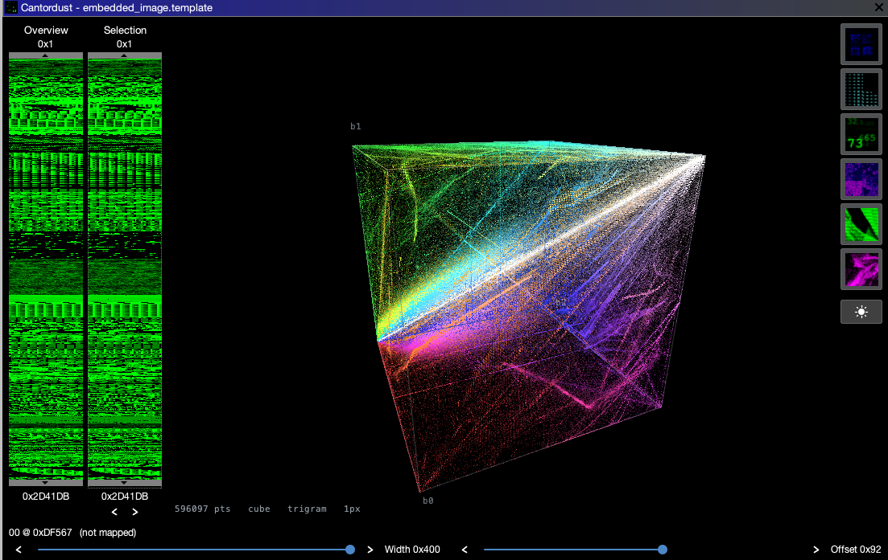
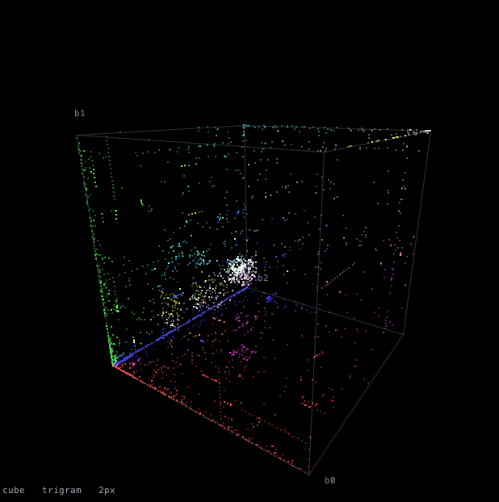
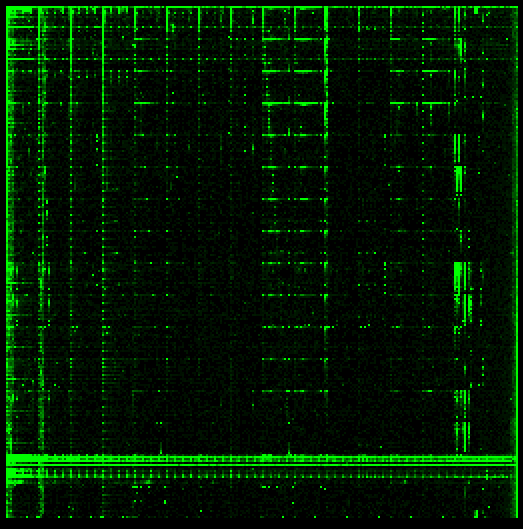
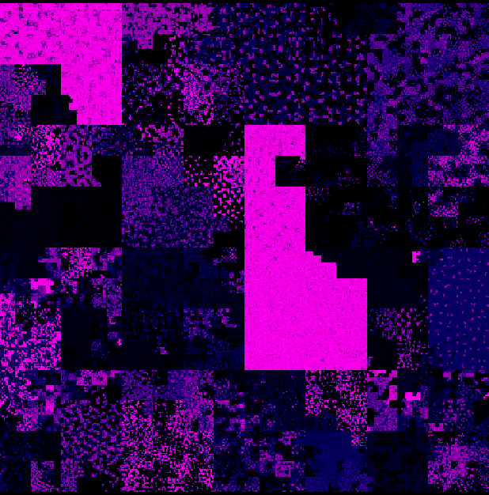
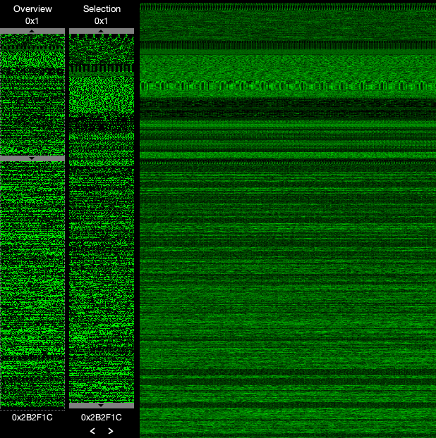

<h1 align="center">Cantordust-Ghidra</h1>

<p align="center">
  <strong>Binary visualization for Ghidra.</strong><br>
  See the shape of a file, then click straight through to the bytes that made it.
</p>

<p align="center">
  
</p>

<p align="center">
  <sub>Every three consecutive bytes of an embedded image as a point in a 256&sup3; cube.<br>
  Clicking a point reports the trigram and jumps the Ghidra listing to it.</sub>
</p>

<p align="center">
  <a href="#visualizations">Visualizations</a> &middot;
  <a href="#installation">Installation</a> &middot;
  <a href="#development">Development</a>
</p>

CantorDust is a binary visulization tool used to aid reverse engineering efforts. It allows humans to utilize their superior visual pattern recognition to identify patterns in binary data.

CantorDust (then ..cantor.dust..) was originally created by Chris Domas (xoreaxeaxeax), with funding from Battelle. The Ghidra plugin version of CantorDust was primarily developed by Battelle interns AJ Snedden and Mike Sengelmann with funding from Battelle. 

Take a look at [this blogpost](https://inside.battelle.org/blog-details/battelle-publishes-open-source-binary-visualization-tool) to learn more about the algorithms and history behind this tool.

## Visualizations

| | |
|:--:|:--:|
|  |  |
| **3-Tuple** — byte triples as points in a 256&sup3; cube | **2-Tuple** — byte pairs on a 256&times;256 grid |
|  |  |
| **Metric Map** — the file along a space-filling curve | **Linear BitMap** — the file as raster scanlines |

Also included: **1-Tuple**, byte values against position, and **Byte Cloud**, the
frequency of each byte value laid out as the hex table.

The **Overview** and **Selection** sliders on the left choose which part of the
file is drawn. Overview picks the window; Selection picks the range inside it.
Files larger than 25 MB are viewed through a 1 MB working window that a third
slider scrolls.

**Cantordust is dependent on Ghidra version 9.1 or higher**

## Installation

1. Clone the repository from Github

2. Install Ghidra **9.1** or higher (Cantordust requires this version or higher)
      1. Download from: [https://ghidra-sre.org](https://ghidra-sre.org/)
      2. Refer to the Ghidra Installation Guide: https://ghidra-sre.org/InstallationGuide.html
3. Open Ghidra and start a new Project
4. Map the Script Manager to your cantordust repo
   1. Click the green play button in the task bar (script manager)
   2. Click on the icon called "script directories" when hovered over
   3. Click the green `+` (plus sign) and add the cantordust directory to the list
5. Run Cantordust for testing
   1. Filter the script manager for `Cantordust.java`. 
   2. Highlight the file and click the green play button

> You can also assign a key binding to Cantordust.java by right clicking on the plugin.

## Updating Cantordust:

1. Navigate to your `cantordust/` directory that stores this repository.
2. run: `git pull`
3. If Ghidra is already open, quit it and run `python3 cleanup.py`. Ghidra
   recompiles changed scripts by itself, but a session that has already loaded
   Cantordust goes on using the classes it started with.
4. Open up Ghidra and launch Cantordust as normal.
   - If a change still does not take effect, see *"Development Tips:"*, section
     *"Ghidra Script Compilation"*.
   - If you're having trouble launching, refer to *"Installation and Setup: Steps 4-5"* 

## Development

Feel free to make modifications, changes and updates to this repository. Below are some tips on how to get started.

#### Ghidra Script API

The Ghidra API is your friend. When in ghidra go to: "Help", and select "Ghidra API Help". This will take you to an interactive html page which provides everything you need to know in order to interact with the API.

In order for Ghidra Scripts to work, the file that is run must extend GhidraScript like so:

```java
import ghidra.app.script.GhidraScript;
public class Cantordust extends GhidraScript { }
```

This class `Cantordust` is the only class that can interact with the API.

> When adding a new `.java` file to the repo, make sure you pass `cantordust` to it as a parameter in it's initialization. The only way you can print when testing a ghidra script, is by calling the class that extends GhidraScript and then calling your print statement. This will print in the Ghidra console. Example Below:

```java
cantordust.printf("");
```

#### Ghidra Script Compilation

Ghidra recompiles a script when its source changes, so a freshly started Ghidra
picks up your edits - including edits to the classes under `resources/`. A
session that already has Cantordust loaded is a different matter: the bundle is
resolved and its classes are in memory, and editing the source underneath it
will not dislodge them. After changing code, quit Ghidra, run `cleanup.py`, and
start it again.

If a change still appears not to apply, check the Ghidra console: when a compile
fails, Ghidra keeps running the last bundle that built successfully, which looks
a lot like a stale cache.

Since Ghidra 9.2 compiled scripts are stored as OSGi bundles under your user
settings directory, one bundle per source directory:

```txt
~/.ghidra/.ghidra_<version>/osgi/compiled-bundles/<hash>/
```

Later Ghidra versions moved this settings directory out of `~/.ghidra` to a
platform-specific location, so the path above is not fixed. To clear the cache
without hunting for it, run:

```sh
python3 cleanup.py            # remove bundles built from this checkout
python3 cleanup.py --dry-run  # show what would be removed
python3 cleanup.py --all      # remove every compiled bundle
```

The script searches the known settings locations, and only removes bundles
containing a class built from this checkout unless you pass `--all`. Use
`--settings-dir` if your Ghidra keeps settings somewhere else.

## License

Apache License 2.0. See [LICENSE](./LICENSE).